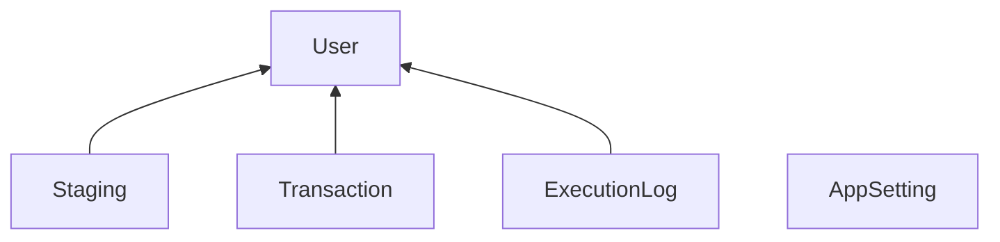

# Performance Experiment

Try to make this run faster. Requires SQL Server 2019 (V15). To test it, run this script. (Takes a couple minutes.) And then run the following statement in 5 query windows so that they all run at the same time. (Takes a minute.)

		use [PerformanceExperiment];
		exec [dbo].[p_RunProcessMessages];

Once they're all done, run the following to check the results.

		use [PerformanceExperiment];
		exec [dbo].[p_PerformanceReport];

# The Challenge
After that, make improvements and repeat the process. You can change procs, indexing, isolation levels, and such. But there are limits:
* Don't change the columns.
* The insert and update must remain in a transaction together.

# What the code does
The code transfers rows from staging to transaction. But each session is for a different user. So one session does not touch the rows that are for another session. The purpose of this is entirely fictional. It's intended to imitate a common concurrent execution situation. After it transfers some rows, it updates those rows in staging so that they don't get transferred again. That insert and update are together in a transaction.

# Change ideas
To improve performance, you might try some of the following.
- Process fewer rows per loop.
- Move the select statement out of the transaction.
- Use table hints to change the locking.
- Use a different transaction isolation level. (Try READ COMMITTED SNAPSHOT).
- Use a table partition on all the tables with a UserID.

# Tables
### Setting
This table gives you control over arbitrary values used in the code. 
- NUMBER OF USERS - Typically 5. This is the number of users created. The fake staging data is distributed amung this number of users.
- RUN SECONDS LIMIT - Typically, 60 seconds. The p_RunProcessTransactions proc stops processing 

### User
This table is primarrilly for reserving a user for a session. The p_RunProcessTransactions proc sets the IsProcessing value for a user. UserID is a foreign key in 3 other tables:
- Staging
- Transaction
- ExecutionLog

### Staging
This table gets loaded with fake data just so that there's something to transfer. 

