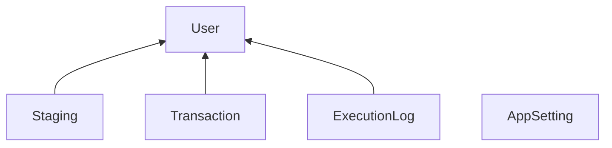

# Performance Experiment

Try to make this run faster. Requires SQL Server 2019 (V15) or newer. To test it, run the PerformanceExperiment-V1.sql script. (Takes a couple minutes.) And then run the following statements in 5 query windows so that they all run at the same time. (Takes a minute.)

		use [PerformanceExperiment];
		exec [dbo].[p_RunProcessMessages];

Once they're all done, run the following to check the results.

		use [PerformanceExperiment];
		exec [dbo].[p_PerformanceReport];

  The most important column is K_Rows_Per_Sec. Higher the better.

# The challenge
After that, make improvements and repeat the process. You can change procs, indexing, isolation levels, and such. But there are limits:
* Don't remove columns.
* Don't remove any foreign key constraints.
* The insert and update must remain in a transaction together.

# What the code does
The code transfers rows from [Staging] to [Transaction]. The transferred rows get timestamped in [Staging] to mark them as complete. It's intended to imitate a common concurrent execution situation. Actually, it's intended to be a typical situation that works better when the tables are partitioned. The insert and update are in a transaction together so that they either both succeed or both roll back. Each session claims a user and only works on that user. So one session does not touch the rows that are for another user.

The arrows represent UserID columns that are enforced as foreign key constraints.

# Change ideas
The performance of this scenario is typically improved by partitioning tables by UserID. That's because such partitioning prevents locks for one user from blocking any other users. But there are many other factors that affect performance with or without partitioning. You might try some of the following.

- Process more or fewer rows per loop.
- Select the rows the will get moved into a temp table instead of doing that in the update statement.
- Put that select inside or outside of the transaction.
- Use UserID as the first column in the clustered index.
- Force table or row level locking with table hints.
- Use a different transaction isolation level. (Try READ COMMITTED SNAPSHOT).
- Use OPTIMIZE_FOR_SEQUENTIAL_KEY.

# [Setting] table
This table gives you control over arbitrary values used in the code. 
- **EXPERIMENT VERSION** - Recorded in [ExecutionLog] so you can tell which type experiment you were running.
- **NUMBER OF USERS** - Typically, 5. This is the number of users created. The fake staging data is distributed among this number of users.
- **RUN SECONDS LIMIT** - Typically, 60. The [p_RunProcessTransactions] proc stops processing at that time limit.
- **PROCESS TRANSACTIONS ROW COUNT** - Typically, 1000 to 100,000. It's the number of rows processed each time [p_ProcessTransactions] is called.

# [p_PerformanceReport]
The proc gets its data from [ExecutionLog]. It finds "Experiments" by looking for gaps when no script was running. The K_Rows_Per_Sec column is the number of 1000 rows per second. Higher the better. The seconds are from the start of the first execution of the [p_ProcessTransactions] proc to the end of the last. That means it includes logging executions, inserting more rows into the Staging table and more.

### Output Columns
- **Experiment** - See above.
- **Version** - The "EXPERIMENT VERSION" setting at the time of the experiment.
- **Row_Count** - The "PROCESS TRANSACTIONS ROW COUNT" setting at the time of the experiment.
- **Users** - Number of users or sessions participating in the experiment.
- **From_Time** - The start of the first session running.
- **Secs** - The total number of seconds the experiment ran for.
- **K_Rows** - The number of rows transferred from [Staging] to [Transaction].
- **K_Rows_Per_Sec** - K_Rows / Secs. Higher the better.
- **Errors** - Number of errors that occurred during the run. Typically deadlocks. Query [ExecutionLog] for more info.

# Go read /More
The [More](https://github.com/chucknewmanjr/PerformanceExperiment/tree/main/More) subfolder contains some additional useful scripts.

- **p_LocksAndBlocks.sql** - Run this while an experiment is running to see all the locks and any blocked and blocking sessions.
- **PerformanceExperiment-V2-Partitioning.sql** - In this version, the [Stagin] and [Transaction] tables are partitioned so that each user is in its own partition.
- **PerformanceExperiment-V3-Play.sql** - This version doesn't have partitioning. But it does have some of the other changes listed above.
- **PerformanceExperiment-V4-Partitioning-Play.sql** - This version has partitioning plus some of the other changes listed above.

