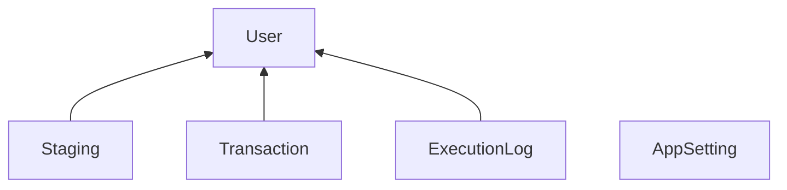

# Performance Experiment

Try to make this run faster. Requires SQL Server 2019 (V15) or newer. To test it, run the PerformanceExperiment-V1.sql script. (Takes a couple minutes.) And then run the following statements in 5 query windows so that they all run at the same time. (Takes a minute.)

		use [PerformanceExperiment];
		exec [dbo].[p_RunProcessMessages];

Once they're all done, run the following to check the results.

		use [PerformanceExperiment];
		exec [dbo].[p_PerformanceReport];

  The most important column is K_Rows_Per_Sec.

# The Challenge
After that, make improvements and repeat the process. You can change procs, indexing, isolation levels, and such. But there are limits:
* Don't change the columns.
* The insert and update must remain in a transaction together.

# What the code does
The code transfers rows from staging to transaction. The transfered rows get timestamped in staging to mark them as complete. It's intended to imitate a common concurrent execution situation. Actually, it's intended to typical situation that works better when the tables are partitioned. The insert and update are in a transaction together so that they either both succeed or both roll back. Each session claims a user and only works on that user. So one session does not touch the rows that are for another user.

# Change ideas
The performance of this scenario is typically improved by partitioning tables by user. That's because such partitioning prevents locks for one user from blocking any other users. But there are many other factors that affect performance with or without partitioning. You might try some of the following.
- Partition staging and transaction tables on user.
- Process more or fewer rows per loop.
- Select the rows to move into a temp table.
- Put that select inside or outside of the transaction.
- Use user as the first column in the clustered index.
- Force table or row level locking with table hints.
- Use a different transaction isolation level. (Try READ COMMITTED SNAPSHOT).
- Use OPTIMIZE_FOR_SEQUENTIAL_KEY.

# Objects
### Setting Table
This table gives you control over arbitrary values used in the code. 
- EXPERIMENT VERSION - Recorded in ExecutionLog so you can tell which experiment you were running.
- NUMBER OF USERS - Typically 5. This is the number of users created. The fake staging data is distributed amung this number of users.
- RUN SECONDS LIMIT - Typically, 60. The [p_RunProcessTransactions] proc stops processing at that time limit.
- PROCESS TRANSACTIONS ROW COUNT - Typically, 1000 to 100,000. It's the number of rows processed each time [p_ProcessTransactions] is called.

### User Table
This table is primarrilly for reserving a user for a session. The [p_RunProcessTransactions] proc sets the SessionID value for a user. UserID is a foreign key in 3 other tables:
- Staging
- Transaction
- ExecutionLog

### Staging Table
This table gets loaded with fake data ahead of time just so that there's something to transfer. In the [p_ProcessTransactions] proc, it gets updated. The update sets the ProcessedDate for the rows transfered.

### Transaction Table
Rows get transfered into this Transaction table.

### ExecutionLog Table
The [p_ProcessTransactions] proc writes to this table each time it runs. 

